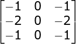

# Sobel Operator

Node.js implementation of the Sobel Operator (Sobel-Feldman operator)
 * Edge Detection (sharp changes in contrast)
 * Standard Sobel X/Y kernels
 * Fast (I was able to process 3 million pixels per second on a laptop)
 
Currently this is only a CLI application, however its code shouldnt be very difficult to implement elsewhere.

```
node sobel.js input.png output.png
```

### Kernels
Y   X 


### Example
Note: This image is very large however it still only took a few seconds to process.


